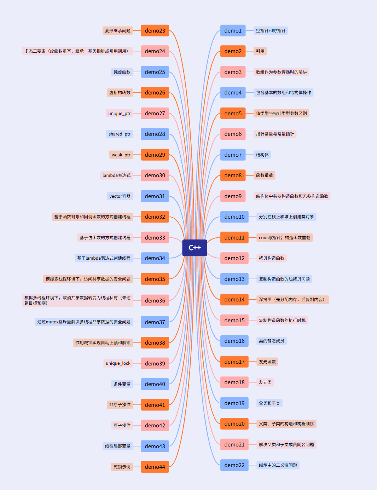

# 5 Linux编程学习记录
[L18830047016/Linux-demo: 通过Linux理解进程、线程、内存、文件描述符等底层原理过程中写的demo](https://github.com/L18830047016/Linux-demo)
# 4  C++
## 4.1开发环境：
VScode纯软件环境；GBK编码注释
## 4.2demo目录：

# 3 FreeRTOS学习记录
[L18830047016/stm32_projects-FreeRTOS: 学习FrRTOS过程中写的项目](https://github.com/L18830047016/stm32_projeceets-FreeRTOS)
# 2 ESP32四轴无人机项目
## 2.1项目出处
本项目参考了 [songge8/CF-Drone: ESP32无人机飞控固件](https://github.com/songge8/CF-Drone) 的开源代码，在理解原理的基础上进行了注释学习和本地化适配。
## 2.2实现功能
本项目是基于**ESP32**平台开发的一套完整的四轴无人机飞行控制系统，实现**姿态解算**、**串级PID控制**、**多模式飞行**、**遥控接收**及**故障保护**等核心功能。系统采用模块化架构设计，支持Web网页遥控。飞控通过**MPU****6500****九轴传感器**获取姿态数据，采用**四元数算法**进行姿态解算，结合**互补滤波**融合陀螺仪与加速度计数据，实现高精度姿态估计。控制部分采用串级PID控制器，内环为角速率环、外环为角度环，输出至四路PWM空心杯电机驱动。系统还实现了**遥控器自动校准**、**电池电压监控**、**参数存储**、**失联自动降落**、**倒置保护**等工程特性。
# 1数据结构与算法
## 1.1学习来源：
B站【逊哥带你学计算机】的《数据结构与算法（2024）》课程
**[《数据结构（C 语言描述）》也许是全站最良心最通俗易懂最好看的数据结构课](https://www.bilibili.com/video/BV1tNpbekEht)**
## 1.2开发环境：
VSCode纯软件环境
## 1.3目的：
通过手写代码夯实嵌入式底层逻辑基础，理解内存管理、指针与结构体的关系、二叉树、链表、顺序表、栈等数据结构以及常用排序、、查找算法。
## 1.4代码结构：

